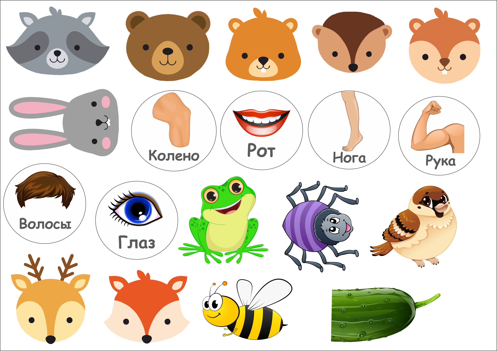

# Инструкция для работы с Markdown

## Выделение текста

Чтобы выделить тексе курсивом необходимо обрамить его звездочками (*) или знаком нижнего подчеркивания. Например *вот так* или _вот так_.

Чтобы выделить текст полужирным, необходимо обрамить его дойными звездочками (**) или двойным знаком нижнего подчеркивания (__). Например, **вот так** или __вот так__. 

Альтренативные способы выделения текста жирным или курсивом нужны для того, чтобы мы могли сомещать оба этих способа. Например, _текст может быть выделен курсивом и при этом быть **полужирным**_. 

## Ссылки

## Работа с таблицами

Чтобы вставить изображение в текст, достаточно написать следующее: 
## Цитаты

Делай все по порядку.
Добавь ветку 2 home_work_2
Добавь ветку 2 home_work_3

## Заключение